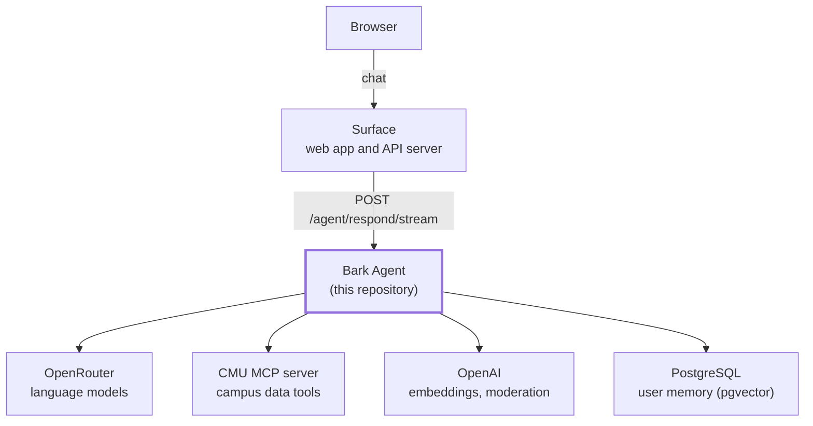

# Bark Agent

Bark Agent is the backend service for Bark, the campus assistant for Carnegie
Mellon University built by ScottyLabs. It receives chat messages from the Bark
web application, answers them with a language model and a set of campus data
tools, applies safety and accuracy checks to each answer, and maintains
long-term memory for each user.

## Overview

Bark consists of two services.

- The Surface ([cmugpt-surface](https://git.cmu.dev/ScottyLabs/cmugpt-surface))
  is the web application and its server. It authenticates users, stores chats,
  and forwards each message to this service.
- The Agent (this repository) processes each message. It selects the campus
  tools the question requires, runs a LangGraph agent against models served
  through OpenRouter, validates the result, and streams the answer back to the
  Surface.

Campus data comes from the CMU MCP server
([mcp-server](https://git.cmu.dev/ScottyLabs/mcp-server)), which publishes
tools for maps, courses, dining, and the student guide over the Model
Context Protocol. OpenAI provides the embeddings for memory search and the
moderation endpoint. Per-user memory is stored in PostgreSQL with the pgvector
extension.



## Request lifecycle

1. Validation. The Surface posts the message, the prior turns of the chat, and
   a hashed user identifier. The service enforces request size limits, checks
   the user's daily token budget, and screens the message with OpenAI's
   moderation endpoint before any model call.
2. Planning. `planning.py` determines what the turn requires: which tool
   groups to bind, whether the `remember` and `forget` tools are needed, and
   whether memory recall should run. Conversational messages bind no data
   tools. The map tool is bound on every turn unless the user has disabled
   maps, since the model decides whether a map belongs in the answer.
3. Execution. `graph.py` runs a LangGraph graph: recall relevant facts about
   the user, invoke the model, execute any tool calls, and repeat until the
   model produces a final answer. Tool output is wrapped as untrusted data so
   that it cannot inject instructions.
4. Verification. `guards.py` and the `maps/` package check the finished
   answer without a model. The model's map selection is validated against the
   building catalog, incorrect claims that a lookup failed are repaired,
   secrets and system prompt text are removed, and tool usage is disclosed
   accurately.
5. Delivery. The answer is streamed to the Surface as Server-Sent Events.
   Once the answer is complete, a background task extracts durable facts
   about the user from the exchange and stores them for future turns.

Memory holds only extracted facts and facts the user explicitly asks Bark to
remember. Raw chat turns are never stored. Users can view and delete their
facts through the Surface, and each user's memory is isolated by identifier.

## Project structure

```
cmugpt-agent/
│
├── src/cmugpt/
│   │
│   ├── api/                    # HTTP layer
│   │   ├── server.py           #   FastAPI app: lifespan, CORS, error envelope, routers
│   │   ├── deps.py             #   Bearer-token and body-size checks shared by routes
│   │   └── routes/
│   │       ├── agent.py        #   /agent/respond, /agent/respond/stream, /agent/title
│   │       ├── memory.py       #   /memory/*
│   │       └── health.py       #   /api/health
│   │
│   ├── settings.py             # All environment variables
│   ├── schema.py               # Request and response models
│   ├── planning.py             # Per-turn tool and memory selection
│   ├── graph.py                # LangGraph control flow
│   ├── prompts.py              # System prompt construction
│   ├── llm.py                  # OpenRouter model client factory
│   ├── mcp_tools.py            # MCP tool discovery and group filtering
│   ├── guards.py               # Deterministic output checks
│   ├── moderation.py           # OpenAI moderation for input and output
│   ├── token_limits.py         # Per-user daily token budget (SQLite)
│   ├── title.py                # Chat title generation
│   │
│   ├── memory/                 # Per-user long-term memory
│   │   ├── store.py            #   LangGraph store: Postgres with pgvector, or in-memory
│   │   ├── facts.py            #   Recall, save, forget
│   │   ├── tools.py            #   The remember and forget tools exposed to the model
│   │   ├── extraction.py       #   Background fact extraction
│   │   └── manage.py           #   List, delete, clear
│   │
│   └── maps/                   # Campus map support
│       ├── buildings.py        #   Building catalog and aliases
│       ├── buildings.json      #   Catalog data
│       ├── tool.py             #   The maps_show_map tool
│       └── inference.py        #   Map validation and URL construction
│
├── tests/unit/                 # Offline tests, run by CI
├── evals/                      # Live evaluations, run manually
│
├── pyproject.toml              # Dependencies, entry point, tool configuration
├── devenv.nix                  # Local environment and Kennel settings
├── flake.nix                   # Nix build
├── secretspec.toml             # Secret declarations
└── .env.example                # Environment variable template
```

## Requirements

- [uv](https://docs.astral.sh/uv/getting-started/installation/). It installs
  Python 3.12 if no suitable interpreter is present.
- PostgreSQL with the [pgvector](https://github.com/pgvector/pgvector)
  extension.
- An [OpenRouter API key](https://openrouter.ai/settings/keys) and an
  [OpenAI API key](https://platform.openai.com/api-keys).

## Installation

The steps below set up local development with the full feature set:
persistent memory, semantic memory search, and moderation. This
configuration is strongly recommended because the service then behaves as
it does in production. The service also starts without `OPENAI_API_KEY` or
`DATABASE_URL`, with the reduced behavior described under Configuration.

1. Clone the repository and install its dependencies.

   ```sh
   git clone https://git.cmu.dev/ScottyLabs/cmugpt-agent.git
   cd cmugpt-agent
   uv sync
   ```

2. Create the memory database. Install
   [PostgreSQL](https://www.postgresql.org/download/) and the
   [pgvector extension](https://github.com/pgvector/pgvector#installation),
   then create an empty database named `cmugpt_agent`. The service creates
   the pgvector extension, its schema, and its tables on first start. The
   [devenv](https://devenv.sh) shell defined in `devenv.nix` is an
   alternative to installing PostgreSQL by hand and provides a database with
   pgvector already set up.

3. Create the environment file and add the API keys.

   ```sh
   cp .env.example .env
   ```

   Then set the two keys in `.env`:

   ```
   OPENROUTER_API_KEY=<your OpenRouter key>
   OPENAI_API_KEY=<your OpenAI key>
   ```

   `MCP_SERVER_URL` and `DATABASE_URL` are prefilled. They point at the
   production MCP server and at the `cmugpt_agent` database on the local
   default socket.

## Configuration

All configuration is read from environment variables by `settings.py`.
`.env.example` documents each variable and its default.

| Variable | Purpose |
| --- | --- |
| `OPENROUTER_API_KEY` | Chat, memory extraction, and chat titles |
| `OPENAI_API_KEY` | Embeddings for memory search and the moderation endpoint. Unset, recall orders facts by recency and moderation is skipped |
| `DATABASE_URL` | PostgreSQL connection string. Unset, memory lives in an in-memory store that is cleared on restart |
| `MCP_SERVER_URL` | Base URL of the CMU MCP server, including the `/mcp` path |
| `AGENT_SHARED_SECRET` | Bearer token the Surface presents on every request. Unset, requests are unauthenticated. Set in production |
| `AGENT_ENV` | `production` makes startup fail without `DATABASE_URL` and an `AGENT_SHARED_SECRET` of at least 32 characters. The `prod` profile of `secretspec.toml` sets it |
| `ALLOWED_ORIGINS` | Comma-separated browser origins for CORS. Default `https://cmugpt.com` |
| `PORT` | Listening port. Default `5055` |
| `TITLE_MODEL` | Model for chat titles. Default `qwen/qwen3.7-flash` |
| `MEMORY_EXTRACTION_MODEL` | Model for background fact extraction. Default `qwen/qwen3.7-flash` |
| `TOKEN_USAGE_DB` | SQLite file for the daily token budget. Default `/tmp/cmugpt_token_usage.sqlite3` |

Production does not read `.env`. Kennel injects `DATABASE_URL` for its managed
PostgreSQL instance, the API keys and `MCP_SERVER_URL` come from OpenBao, and
`AGENT_SHARED_SECRET` is set so that only the Surface can call the service.
See Deployment.

## Running the service

```sh
uv run cmugpt-agent
```

The service listens on port 5055. Confirm it is healthy:

```sh
curl -s localhost:5055/api/health
```

```json
{"status":"ok","memory":{"backend":"postgres","initialized":true,"semantic_search":true,"embedding_model":"text-embedding-3-large","ready":true}}
```

`backend` reports `in-memory` when `DATABASE_URL` is unset, and
`semantic_search` is `false` when `OPENAI_API_KEY` is unset. The endpoint
returns HTTP 503 with `"status": "degraded"` when the memory store cannot be
queried.

## API

When `AGENT_SHARED_SECRET` is set, every route except `/api/health` requires
the header `Authorization: Bearer <secret>`.

| Route | Description |
| --- | --- |
| `POST /agent/respond` | Returns the complete answer as a JSON object |
| `POST /agent/respond/stream` | Returns the answer as Server-Sent Events |
| `POST /agent/title` | Generates a short title from a chat's first message |
| `GET /memory/{user_id}` | Lists a user's stored facts, with search and paging |
| `DELETE /memory/{user_id}/items/{kind}/{item_id}` | Deletes one fact |
| `DELETE /memory/{user_id}` | Deletes all facts for a user |
| `GET /api/health` | Service status and active memory backend |

Example request:

```sh
curl -s localhost:5055/agent/respond \
  -H 'content-type: application/json' \
  -d '{"query": "What is open for lunch near Gates?", "user_id": "example"}'
```

Request fields for `/agent/respond` and `/agent/respond/stream`:

| Field | Description |
| --- | --- |
| `query` | The user's message. Required. At most 8,000 characters |
| `user_id` | Identifier for memory and the token budget. The Surface sends a hash of the authenticated user |
| `message_history` | Prior turns as `{"role", "content"}` objects. The last 40 are used |
| `model` | OpenRouter model identifier. Default `openai/gpt-5.6-luna` |
| `disabled_tools` | Tool groups the user has switched off: `maps`, `courses`, `eats`, `guide` |

The streaming endpoint emits `status` events while tools run, `delta` events
carrying text as it is generated, a `map` event when a campus map accompanies
the answer, a `memory` event when a fact is saved or removed, and a final
`done` event containing the complete response object. An `error` event
terminates a failed turn.

Each user is limited to one million tokens per day. Requests beyond that
limit receive HTTP 429.

## Testing

```sh
DATABASE_URL="" uv run pytest    # offline unit tests, as run by CI
uv run pytest evals              # live evaluations
```

Unit tests in `tests/unit/` run with the model replaced by a stub and an
in-memory store. They are deterministic and fail only when code is incorrect.

Evaluations in `evals/` send real questions to the configured model and MCP
server and check the behavior of the answers: tool usage, refusal of prompt
injection, and absence of fabricated details. They require `OPENROUTER_API_KEY`
and `MCP_SERVER_URL`, incur API costs, and skip automatically when the keys
are absent. They are not part of the default `pytest` run.

## Development

```sh
uv run ruff format    # format
uv run ruff check     # lint. The project configuration applies fixes.
uv run ty check       # type check
```

## Deployment

Production runs on [Kennel](https://git.cmu.dev/ScottyLabs/kennel), the
ScottyLabs deployment platform. Kennel builds the `agent` package defined in
`flake.nix` and runs its `cmugpt-agent` entry point as a systemd unit, with
`PORT`, `DATABASE_URL`, and the secrets from the `prod` profile of
`secretspec.toml` injected as environment variables. That profile sets
`AGENT_ENV=production`, so the service refuses to start without `DATABASE_URL`
and an `AGENT_SHARED_SECRET` of at least 32 characters. Pushes to `main` on
git.cmu.dev trigger a deployment, and each pull request receives a preview
deployment.

- <https://api.cmugpt-agent.scottylabs.org> (custom domain)
- <https://cmugpt-agent-agent-main.scottylabs.net> (default Kennel URL)

Production secrets are stored in OpenBao and managed with secretspec.

## Code style

Do not disable `ruff` or `ty` rules for the whole project. Where a line
requires an exception, use the narrowest directive that applies, in this
order of preference.

For `ty`:

1. `# ty: ignore[<rule>]` for a single rule
2. `# ty: ignore[rule1, rule2]` for several rules
3. `# type: ignore` or `# type: ignore[<rule>]` for all violations on the line, even when a rule is named
4. `@typing.no_type_check` on a function

For `ruff`:

1. `# noqa: <rule>` for a single rule
2. `# noqa: rule1, rule2` for several rules
3. `# noqa` for all violations on the line
4. `# ruff: noqa: <rule>` for a single rule across a file
5. `# ruff: noqa` for all violations across a file

## Related repositories

- [cmugpt-surface](https://git.cmu.dev/ScottyLabs/cmugpt-surface): the web application and its server.
- [mcp-server](https://git.cmu.dev/ScottyLabs/mcp-server): the CMU MCP server that publishes the campus data tools.
- [kennel](https://git.cmu.dev/ScottyLabs/kennel): the deployment platform.

## License

Apache License 2.0. See [LICENSE](LICENSE).
